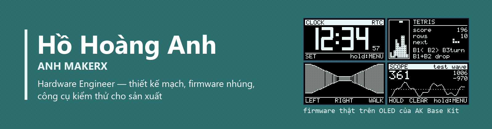

  

---

## Xin chào

Tôi là **Hồ Hoàng Anh**, kỹ sư phần cứng. Tôi thiết kế mạch điện tử, viết firmware cho vi điều khiển và làm công cụ
kiểm thử cho sản xuất. Ở đây tôi chia sẻ những thứ làm được ngoài giờ, chủ yếu quanh firmware nhúng.

*Hardware Engineer | Designing and Building Electronics with Creativity and Passion.*

## Dự án nổi bật

### [ak-base-kit-pio](https://github.com/hohoanganh/ak-base-kit-pio) — nền firmware cho STM32L151

Nền firmware bare-metal dựng lại từ [AK Base Kit](https://github.com/the-ak-foundation/ak-base-kit-stm32l151) của
AK Foundation: kernel hướng sự kiện không cần RTOS, bootloader, cập nhật firmware qua UART và RS485.

| | |
|---|---|
| **Chạy thử ngay** | [Firmware chạy trong trình duyệt](https://hohoanganh.github.io/ak-base-kit-pio/play/), không cần kit |
| **Xem demo** | [16 màn hình trên OLED 128×64](https://github.com/hohoanganh/ak-base-kit-pio/blob/main/docs/demo-kit.md): game, 3D, video, máy hiện sóng |
| **Tải firmware** | [Releases](https://github.com/hohoanganh/ak-base-kit-pio/releases) |
| **Bắt đầu dự án mới** | [Trang giới thiệu](https://hohoanganh.github.io/ak-base-kit-pio/) |

 

Vài điểm tôi thấy đáng xem trong dự án này:

- **Một mã nguồn, ba nơi chạy.** Cùng mã C chạy trên chip, trong unit test trên máy tính, và trong trình duyệt
  (WebAssembly), vì ranh giới với bo mạch được giữ thật mỏng.
- **Firmware tự kể lại sự cố của nó.** HardFault, FATAL, watchdog và task treo đều được ghi vào EEPROM và báo ở lần khởi động sau.
- **Bootloader chịu được mất điện.** Unit test giả lập cắt điện ở 1366 điểm trong lúc cài; lần nào cũng khôi phục được.
- **Ảnh trong tài liệu không phải ảnh chụp.** Chúng được dựng từ chính mã vẽ của firmware, nên không bao giờ lệch với thực tế.

## Tôi làm gì

| Mảng | Công việc |
|---|---|
| **Phần cứng** | Schematic, PCB, đưa board từ bản vẽ tới sản xuất |
| **Firmware** | STM32, ESP32, nRF52; Modbus RTU, bootloader, OTA |
| **Công cụ** | Tool test và nạp firmware cho dây chuyền, viết bằng Python |

## Cộng đồng

Các dự án ở đây đứng trên nền của [AK Foundation](https://github.com/the-ak-foundation), nhóm làm sản phẩm phần mềm
nhúng tại Việt Nam. Nếu bạn mới học lập trình hướng sự kiện cho vi điều khiển, hãy bắt đầu từ
[chương trình đào tạo](https://github.com/the-ak-foundation/embedded-training-program) của họ.

## Liên hệ

- Góp ý hoặc báo lỗi: mở [issue](https://github.com/hohoanganh/ak-base-kit-pio/issues) ở dự án tương ứng.
- TikTok: [@hohoanganh1](https://www.tiktok.com/@hohoanganh1)
